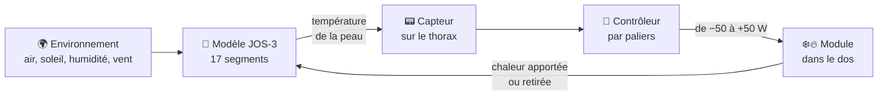

<div align="center">

# 🌡️ Thermorégulation active — simulation JOS-3

**Un dispositif porté qui chauffe ou refroidit le dos du patient pour l'aider à garder une température stable.**
Simulation d'une boucle de régulation fermée sur un modèle thermophysiologique du corps humain, appliquée à trois profils thermosensibles.


*Projet PRICE 39 · Safran Tech × MicroPower*

</div>

---

## Sommaire

1. [Le problème](#probleme)
2. [Notre approche](#approche)
3. [Comment fonctionne la simulation](#simulation)
4. [Les trois scénarios](#scenarios)
5. [Résultats](#resultats)
6. [Où placer le capteur ?](#capteur)
7. [Limites et pistes](#limites)
8. [Lancer le projet](#lancer)

---

<a id="probleme"></a>

## 🔥 Le problème

Certaines personnes ne régulent pas bien leur température corporelle, et pour elles quelques dixièmes de degré peuvent tout changer.

| Profil | Ce qui se passe |
|---|---|
| **Sclérose en plaques (SEP)** | Une légère hausse de la température centrale peut aggraver temporairement les symptômes (fatigue, troubles visuels, faiblesse) : c'est le **phénomène d'Uhthoff**. Une simple séance de kinésithérapie peut suffire à le déclencher. |
| **Hémodialyse** | Le sang circule dans un circuit extérieur au corps et s'y refroidit. Au fil d'une séance de plusieurs heures, le patient perd de la chaleur, a froid et peut frissonner. |
| **Sport de performance** | Un effort intense au soleil fait monter la température centrale ; au-delà d'un certain point, la performance chute et le risque de coup de chaleur augmente. |

Aujourd'hui, ces situations sont surtout **subies**. L'idée du projet est de les **anticiper**.

<a id="approche"></a>

## 💡 Notre approche

Un dispositif porté au niveau du **dos**, capable de **chauffer ou de refroidir** (jusqu'à ±50 W), piloté par un **capteur de température cutanée placé sur le thorax**.

Pourquoi un capteur sur la peau et pas directement la température centrale ? Parce que la température du sang central (Tcb) est la grandeur qui compte physiologiquement, mais elle **n'est pas mesurable** par un objet porté au quotidien. La peau, elle, l'est. Toute la question devient alors : *la température de la peau suit-elle assez bien celle du corps pour servir de signal de pilotage ?*

Avant de construire le moindre prototype, nous avons testé cette idée **en simulation**.

<a id="simulation"></a>

## ⚙️ Comment fonctionne la simulation

### Le modèle du corps : JOS-3

Nous utilisons [JOS-3](https://github.com/TanabeLab/JOS-3), un modèle thermophysiologique open-source qui découpe le corps en **17 segments** (tête, cou, thorax, dos, bassin, bras, mains, cuisses, jambes, pieds…). À chaque pas de temps, il calcule pour chaque segment la température de la peau, et pour l'ensemble du corps la température centrale, en tenant compte des mécanismes naturels : transpiration, frissons, vasoconstriction et vasodilatation.

On lui fournit un **profil** (taille, poids, masse grasse, âge, sexe), des **vêtements** (isolation thermique par segment) et un **environnement** (température de l'air, rayonnement, humidité, vent, niveau d'activité physique).

### La boucle de régulation

Toutes les minutes de simulation, le programme répète le même cycle :



1. On lit la température cutanée du thorax.
2. Le contrôleur décide d'une puissance.
3. Cette puissance est appliquée sur la peau du dos.
4. JOS-3 fait avancer le corps d'une minute.
5. On enregistre toutes les températures, puis on recommence.

### La loi de commande

Le contrôleur est volontairement simple et fonctionne **par paliers** :

- entre les deux seuils, le dispositif est **éteint** (zone neutre) ;
- au-dessus du seuil haut, il **refroidit** : 5 W de plus par tranche de 0,1 °C d'écart ;
- en dessous du seuil bas, il **chauffe**, selon la même logique ;
- la puissance est **plafonnée à 50 W**, la limite de notre matériel.

<p align="center">
  
</p>

<details>
<summary><b>La formule exacte</b></summary>

Avec $T$ la température cutanée du thorax :

```math
P(T) =
\begin{cases}
-5 \times \min\left(\left\lceil \dfrac{T - T_{\text{froid}}}{0.1} \right\rceil,\ 10\right) \ \text{W} & \text{si } T > T_{\text{froid}} \\[2ex]
+5 \times \min\left(\left\lceil \dfrac{T_{\text{chaud}} - T}{0.1} \right\rceil,\ 10\right) \ \text{W} & \text{si } T < T_{\text{chaud}} \\[2ex]
0 & \text{sinon}
\end{cases}
```

Par défaut, $T_{\text{froid}} = 34{,}8$ °C et $T_{\text{chaud}} = 33{,}0$ °C. Pour le scénario SEP, les seuils sont abaissés à 33,4 °C et 32,0 °C, car ces patients doivent être protégés plus tôt.

</details>

<a id="scenarios"></a>

## 🧪 Les trois scénarios

| | 🏃 Sportif | 🧑‍⚕️ Patient SEP | 🩸 Patient dialysé |
|---|---|---|---|
| **Profil** | Homme, 28 ans, 72 kg | Femme, 45 ans, 65 kg | Homme, 68 ans, 75 kg |
| **Situation** | Course au soleil, pause à l'ombre, sprint final | Séance de kinésithérapie en intérieur | Séance d'hémodialyse assise |
| **Durée** | 55 min | 60 min | 190 min |
| **Risque visé** | Surchauffe | Hausse de température (Uhthoff) | Refroidissement |
| **Particularité** | Fort rayonnement solaire, effort intense | Seuils abaissés | Perte de 50 W au niveau central pendant la séance, pour représenter le refroidissement du sang dans le circuit |

<details>
<summary><b>Détail des phases de chaque scénario</b></summary>

**Sportif**

| Phase | Durée | Air | Rayonnement | Activité |
|---|---|---|---|---|
| Course intense au soleil | 30 min | 32 °C | 45 °C | ×6 |
| Arrêt à l'ombre | 10 min | 24 °C | 24 °C | ×1,2 |
| Sprint final | 15 min | 30 °C | 38 °C | ×8 |

**Patient SEP** — pièce à 24 °C

| Phase | Durée | Activité | Posture |
|---|---|---|---|
| Repos avant séance | 5 min | ×1,0 | assis |
| Échauffement léger | 10 min | ×2,0 | debout |
| Exercices soutenus | 35 min | ×4,0 | debout |
| Récupération | 10 min | ×1,2 | assis |

**Patient dialysé** — assis, activité au repos

| Phase | Durée | Air | Perte centrale |
|---|---|---|---|
| Installation | 10 min | 22 °C | — |
| Début de séance | 60 min | 21 °C | 50 W |
| Mi-séance (frissons) | 90 min | 21 °C | 50 W |
| Fin de séance | 30 min | 22 °C | — |

*L'activité est exprimée en multiple du métabolisme de repos (PAR, « Physical Activity Ratio »).*

</details>

<a id="resultats"></a>

## 📊 Résultats

### Comment lire les figures

Chaque scénario produit une figure en cinq panneaux :

| Panneau | Ce qu'il montre |
|---|---|
| **En haut** | Les températures de la peau segment par segment, avec la température centrale (Tcb) en noir épais. Les fonds colorés délimitent les phases. Seul le côté gauche du corps est affiché, le corps étant symétrique. |
| **Milieu gauche** | La température centrale comparée à la température moyenne de la peau. |
| **Milieu droite** | La puissance du dispositif minute par minute : barres rouges pour le refroidissement, bleues pour la chauffe. |
| **En bas à gauche** | Le classement des segments selon la corrélation entre leur température et la température centrale. Les 5 meilleurs sont en rouge. |
| **En bas à droite** | La température centrale superposée aux 5 segments les mieux classés. |

### 🏃 Sportif

<p align="center"></p>

Le dispositif refroidit pendant **41 minutes sur 55**. Il monte rapidement à pleine puissance au début de la course, relâche à l'ombre, puis repart à fond pendant le sprint. La peau du dos descend jusqu'à **29,9 °C** sous l'effet du module. Malgré cela, la température centrale grimpe de 36,7 °C à **38,1 °C** : face à un effort aussi intense au soleil, 50 W concentrés sur le dos restent limités.

### 🧑‍⚕️ Patient SEP

<p align="center"></p>

Grâce aux seuils abaissés, le dispositif démarre **dès le repos** à pleine puissance, puis se relance pendant les exercices soutenus (42 minutes de refroidissement au total). La température centrale culmine à **37,36 °C** et reste sous le seuil de 37,5 °C retenu dans le projet pour le phénomène d'Uhthoff. La peau du dos descend en revanche jusqu'à **24,7 °C** en début de séance, ce qui pose une question de confort.

### 🩸 Patient dialysé

<p align="center"></p>

Le scénario inverse : le dispositif **chauffe** pendant **181 minutes sur 190**, presque toujours au maximum de 50 W. La température centrale baisse lentement de 37,1 °C à 36,6 °C. Point d'alerte important : la peau du dos atteint **45,4 °C** sous une chauffe prolongée sur un seul segment.

> [!WARNING]
> Une température cutanée de 45 °C maintenue pendant des heures présente un risque de brûlure. En conditions réelles, il faudra **répartir la puissance sur plusieurs zones** et prévoir un **arrêt de sécurité** au-delà d'une température cutanée limite.

### Bilan

| Scénario | Tcb (min → max) | Refroidissement | Chauffe | Inactif | Énergie thermique échangée* |
|---|---|---|---|---|---|
| 🏃 Sportif | 36,69 → 38,06 °C | 41 min | 0 min | 14 min | ≈ 18 Wh |
| 🧑‍⚕️ SEP | 36,79 → 37,36 °C | 42 min | 0 min | 18 min | ≈ 12 Wh |
| 🩸 Dialyse | 36,63 → 37,14 °C | 0 min | 181 min | 9 min | ≈ 148 Wh |

<sub>* Somme des puissances appliquées sur la peau au cours de la séance. Il s'agit de chaleur échangée, pas de consommation électrique : celle-ci dépendra du rendement du module (Peltier ou autre) et sera plus élevée.</sub>

<a id="capteur"></a>

## 📍 Où placer le capteur ?

Le notebook classe chaque segment selon la **corrélation de Pearson** entre sa température cutanée et la température centrale sur toute la simulation. Plus le score est proche de 1, plus la peau de cette zone « suit » la température du corps.

| Scénario | Les 3 meilleurs segments | Score du thorax (capteur actuel) |
|---|---|---|
| 🏃 Sportif | main 0,94 · pied 0,91 · tête 0,83 | 0,39 |
| 🧑‍⚕️ SEP | main 0,92 · pied 0,89 · bras 0,89 | 0,01 |
| 🩸 Dialyse | pied 0,998 · bras 0,995 · main 0,993 | 0,91 |

Deux enseignements ressortent :

- **Les extrémités (main, pied) suivent le mieux la température centrale** dans les trois scénarios, sans doute parce que la circulation sanguine y varie beaucoup selon l'état thermique du corps.
- **Le thorax, où se trouve notre capteur, est mal corrélé** dans deux scénarios sur trois. C'est un vrai sujet pour la suite du projet.

> [!IMPORTANT]
> Ce score est à interpréter avec prudence. Il ne tient compte ni du **décalage dans le temps** entre peau et température centrale, ni du **bruit** d'un vrai capteur. Il est aussi gonflé quand toutes les températures évoluent dans le même sens : en dialyse, presque tous les segments dépassent 0,9 simplement parce que tout le corps se refroidit ensemble. Enfin, une main ou un pied bouge beaucoup, ce qui en fait des emplacements difficiles pour un capteur au quotidien.

<a id="limites"></a>

## ⚠️ Limites et pistes

**Ce que ce travail n'est pas** : une validation clinique. Ce sont des simulations sur un modèle, avec des scénarios et des seuils choisis par nous.

**Limites actuelles**

- Un seul segment est actionné (le dos), ce qui produit des températures locales extrêmes (24,7 °C et 45,4 °C).
- Les seuils sont réglés à la main, séparément pour chaque scénario.
- Le signal du capteur n'est pas filtré, alors que les changements brusques d'environnement créent des variations rapides de la température cutanée.
- Le notebook ne compare pas encore chaque scénario à la même situation **sans dispositif**, ce qui est indispensable pour mesurer son effet réel.
- Le code utilise une méthode interne de JOS-3 (`_set_ex_q`) pour appliquer la chaleur, d'où la version figée dans `requirements.txt`.

**Pistes pour la suite**

- [ ] Ajouter une simulation de référence sans dispositif pour chaque scénario
- [ ] Répartir la puissance sur plusieurs segments
- [ ] Ajouter un arrêt de sécurité sur la température cutanée locale
- [ ] Filtrer le signal du capteur
- [ ] Tester un régulateur plus fin (PI, par exemple)
- [ ] Affiner le choix du capteur en intégrant le décalage temporel et le bruit

<a id="lancer"></a>

## 🚀 Lancer le projet

**Prérequis** : Python 3.10 ou plus récent.

```bash
git clone https://github.com/<ton-pseudo>/<nom-du-depot>.git
cd <nom-du-depot>
pip install -r requirements.txt
jupyter notebook simulation_thermoregulation.ipynb
```

Il suffit ensuite d'exécuter toutes les cellules. Les trois simulations prennent quelques secondes.

### Organisation du dépôt

```
.
├── README.md                           ← ce fichier
├── simulation_thermoregulation.ipynb   ← tout le code : modèle, contrôleur, scénarios, graphiques
├── requirements.txt                    ← dépendances Python
└── figures/                            ← images utilisées dans ce README
    ├── loi_de_commande.png
    ├── scenario_sport.png
    ├── scenario_sep.png
    └── scenario_dialyse.png
```

## 📚 Référence

Takahashi, Y., Nomoto, A., Yoda, S., Hisayama, R., Ogata, M., Ozeki, Y., & Tanabe, S. (2021). *Thermoregulation model JOS-3 with new open source code.* Energy and Buildings, 231, 110575.

## 👥 Équipe

Projet réalisé dans le cadre de **PRICE 39**, porté par Safran Tech via l'incubateur MicroPower.

*À compléter : noms et rôles des membres de l'équipe.*
