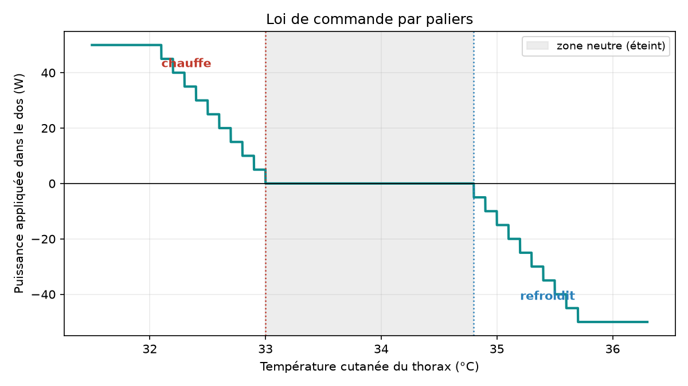
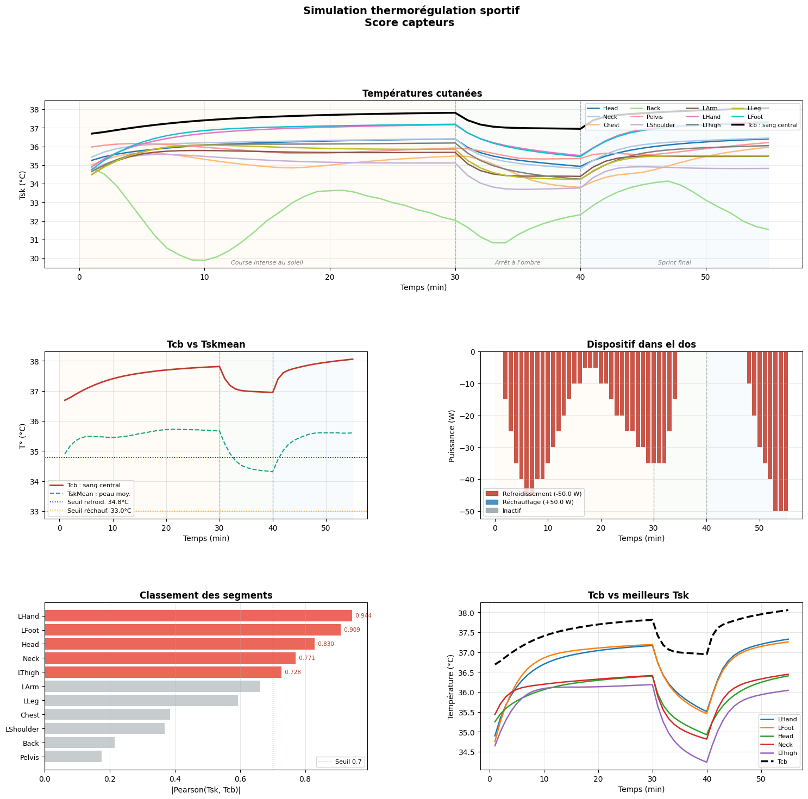
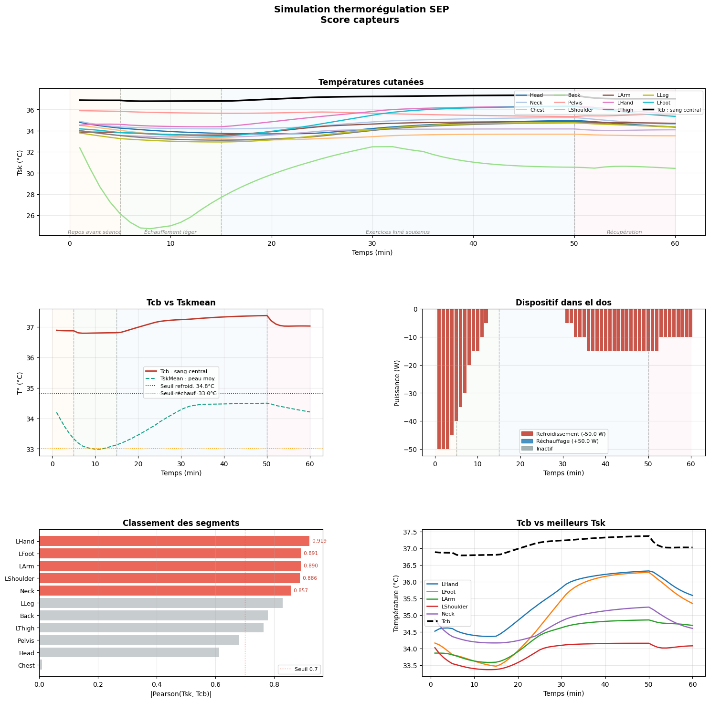
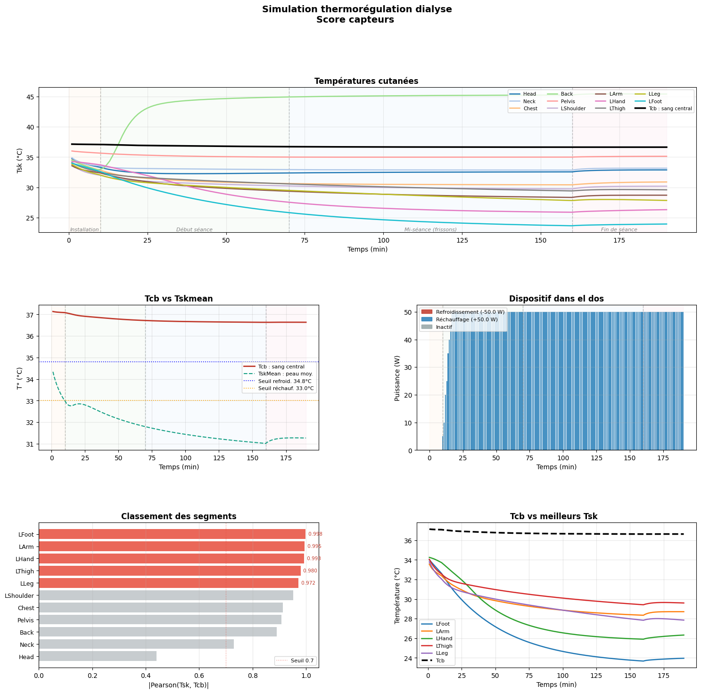

# Active Thermoregulation: JOS-3 Simulation

A wearable device that heats or cools a patient's back to help keep body temperature stable. This project simulates a closed-loop control system on a thermophysiological model of the human body, tested against three heat-sensitive patient profiles.


Project PRICE 39, Safran Tech / MicroPower.

## The problem

Some people don't regulate body temperature well, and for them a few tenths of a degree matter.

- **Multiple sclerosis (MS)**: a small rise in core temperature can temporarily worsen symptoms such as fatigue, vision problems and weakness. This is Uhthoff's phenomenon, and it can be triggered by something as mild as a physiotherapy session.
- **Hemodialysis**: blood circulates through an external circuit and cools there. Over a multi-hour session, patients lose heat and can start shivering.
- **Endurance sport**: intense effort in the sun raises core temperature. Past a certain point, performance drops and heat stroke risk rises.

Right now these situations are mostly just endured. The point of this project is to anticipate them instead.

## Approach

A device worn on the back, able to heat or cool by up to 50 W in either direction, controlled by a skin temperature sensor on the chest.

Why a chest skin sensor instead of core temperature directly? Core blood temperature (Tcb) is what matters physiologically, but it isn't something an everyday wearable can measure. Skin temperature is. So the real question is whether skin temperature tracks the body closely enough to be a useful control signal.

Before building any hardware, we tested this in simulation.

## How the simulation works

### Body model: JOS-3

We use [JOS-3](https://github.com/TanabeLab/JOS-3), an open-source thermophysiological model that splits the body into 17 segments (head, neck, chest, back, pelvis, arms, hands, thighs, legs, feet, etc). At each time step it computes skin temperature per segment and core temperature for the whole body, accounting for sweating, shivering, vasoconstriction and vasodilation.

Inputs are a profile (height, weight, body fat, age, sex), clothing (thermal insulation per segment) and an environment (air temperature, radiation, humidity, wind, activity level).

### Control loop

Every simulated minute, the program repeats the same cycle:

1. Read chest skin temperature.
2. The controller decides on a power level.
3. That power is applied to the back.
4. JOS-3 advances the body by one minute.
5. All temperatures are logged, then it repeats.

### Control law

The controller is a simple step function:

- Between the two thresholds, the device is off (neutral zone).
- Above the high threshold, it cools: 5 W more per 0.1 degC of overshoot.
- Below the low threshold, it heats, using the same logic.
- Power is capped at 50 W, the limit of our hardware.

Default thresholds are 34.8 degC (cooling) and 33.0 degC (heating). For the MS scenario, thresholds are lowered to 33.4 and 32.0 degC, since these patients need to be protected earlier.

<p align="center">
  
</p>

## Three scenarios

| | Athlete | MS patient | Dialysis patient |
|---|---|---|---|
| Profile | Male, 28, 72 kg | Female, 45, 65 kg | Male, 68, 75 kg |
| Situation | Run in the sun, shade break, final sprint | Indoor physiotherapy session | Seated hemodialysis session |
| Duration | 55 min | 60 min | 190 min |
| Risk targeted | Overheating | Uhthoff's phenomenon | Cooling |
| Notes | Strong solar radiation, intense effort | Lowered thresholds | 50 W core heat loss during the session, simulating blood cooling in the circuit |

<details>
<summary>Phase-by-phase detail for each scenario</summary>

**Athlete**

| Phase | Duration | Air | Radiation | Activity |
|---|---|---|---|---|
| Intense run in the sun | 30 min | 32 degC | 45 degC | x6 |
| Shade break | 10 min | 24 degC | 24 degC | x1.2 |
| Final sprint | 15 min | 30 degC | 38 degC | x8 |

**MS patient** (room at 24 degC)

| Phase | Duration | Activity | Posture |
|---|---|---|---|
| Rest before session | 5 min | x1.0 | sitting |
| Light warm-up | 10 min | x2.0 | standing |
| Sustained exercise | 35 min | x4.0 | standing |
| Recovery | 10 min | x1.2 | sitting |

**Dialysis patient** (seated, resting activity)

| Phase | Duration | Air | Core loss |
|---|---|---|---|
| Setup | 10 min | 22 degC | none |
| Session start | 60 min | 21 degC | 50 W |
| Mid-session (shivering) | 90 min | 21 degC | 50 W |
| Session end | 30 min | 22 degC | none |

Activity is expressed as a multiple of resting metabolism (PAR, Physical Activity Ratio).

</details>

## Results

Each scenario produces a five-panel figure: skin temperature per segment with core temperature (Tcb) in bold black (top), core vs. mean skin temperature (middle left), device power minute by minute, cooling in red and heating in blue (middle right), segments ranked by correlation with core temperature (bottom left), and core temperature against the top 5 ranked segments (bottom right). Only the left side of the body is shown, since it's symmetric.

**Athlete**: the device cools for 41 of 55 minutes, running at full power at the start of the run, easing off in the shade, then maxing out again during the sprint. Back skin temperature drops to 29.9 degC. Even so, core temperature climbs from 36.7 to 38.1 degC: against effort this intense in the sun, 50 W on one back segment isn't enough.

<p align="center"></p>

**MS patient**: with lowered thresholds, the device runs at full power from the start, then again during sustained exercise (42 minutes of cooling total). Core temperature peaks at 37.36 degC, staying under the 37.5 degC threshold we set for Uhthoff's phenomenon. Back skin temperature drops to 24.7 degC early in the session, which raises a comfort question.

<p align="center"></p>

**Dialysis patient**: the reverse case. The device heats for 181 of 190 minutes, almost always at the 50 W cap. Core temperature drifts down slowly from 37.1 to 36.6 degC. One concern: back skin temperature reaches 45.4 degC under sustained heating on a single segment, which is a burn risk if held for hours. A real device would need to spread power across multiple zones and include a safety cutoff above some skin temperature limit.

<p align="center"></p>

**Summary**

| Scenario | Tcb (min to max) | Cooling | Heating | Off | Thermal energy exchanged* |
|---|---|---|---|---|---|
| Athlete | 36.69 to 38.06 degC | 41 min | 0 min | 14 min | ~18 Wh |
| MS | 36.79 to 37.36 degC | 42 min | 0 min | 18 min | ~12 Wh |
| Dialysis | 36.63 to 37.14 degC | 0 min | 181 min | 9 min | ~148 Wh |

<sub>* Sum of power applied to the skin during the session. This is heat exchanged, not electrical consumption, which will be higher and depends on the module's efficiency (Peltier or otherwise).</sub>

## Where to place the sensor

The notebook ranks each segment by Pearson correlation between its skin temperature and core temperature over the full simulation. A score closer to 1 means that segment's skin tracks core temperature more closely.

| Scenario | Top 3 segments | Chest score (current sensor) |
|---|---|---|
| Athlete | hand 0.94, foot 0.91, head 0.83 | 0.39 |
| MS | hand 0.92, foot 0.89, arm 0.89 | 0.01 |
| Dialysis | foot 0.998, arm 0.995, hand 0.993 | 0.91 |

Two takeaways stand out. Extremities (hands, feet) track core temperature best across all three scenarios, likely because blood flow there varies a lot with the body's thermal state. The chest, where our current sensor sits, correlates poorly in two of the three scenarios, which is a real problem for the next phase of the project.

This score should be read with caution. It ignores the time lag between skin and core temperature and the noise of a real sensor. It's also inflated whenever temperatures move together: in the dialysis scenario, nearly every segment scores above 0.9 simply because the whole body is cooling at once. Hands and feet also move a lot in daily life, which makes them impractical sensor locations.

## Limitations and next steps

This is not clinical validation. These are simulations on a model, with scenarios and thresholds we chose ourselves.

Current limitations:

- Only one segment (the back) is actuated, which produces extreme local temperatures (24.7 and 45.4 degC).
- Thresholds are hand-tuned separately for each scenario.
- The sensor signal isn't filtered, even though fast environment changes cause rapid swings in skin temperature.
- The notebook doesn't yet compare each scenario to the same situation without the device, which is needed to measure its actual effect.
- The code relies on an internal JOS-3 method (`_set_ex_q`) to apply heat, hence the pinned version in `requirements.txt`.

Next steps:

- Add a baseline simulation without the device for each scenario
- Spread power across multiple segments
- Add a safety cutoff based on local skin temperature
- Filter the sensor signal
- Try a finer controller, e.g. PI
- Refine sensor placement accounting for time lag and noise

## Running the project

Requires Python 3.10 or later.

```bash
git clone https://github.com/AdemmBr/Thermoregulation-project.git
cd Thermoregulation-project
pip install -r requirements.txt
jupyter notebook simulation_thermoregulation.ipynb
```

Run all cells. The three simulations take a few seconds.

Repo layout:

```
.
├── README.md
├── simulation_thermoregulation.ipynb   (model, controller, scenarios, plots)
├── requirements.txt
└── figures/
```

## Reference

Takahashi, Y., Nomoto, A., Yoda, S., Hisayama, R., Ogata, M., Ozeki, Y., & Tanabe, S. (2021). Thermoregulation model JOS-3 with new open source code. Energy and Buildings, 231, 110575.

## Team

Built as part of PRICE 39, run by Safran Tech through the MicroPower incubator.

*Team names and roles to be added.*
